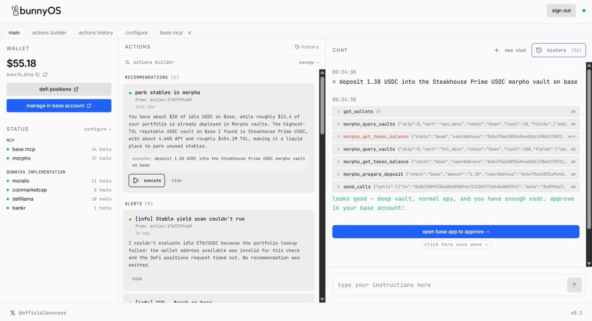

<div align="center">

<h1 align="center">
  <picture>
    <source width="400" media="(prefers-color-scheme: dark)" srcset="assets/full-dark.png">
    
  </picture>
</h1>

<p align="center">
  <a href="https://bunnyos.ai"></a>
  <a href="https://github.com/bunnyos/base-agent"></a>
  <a href="https://discord.gg/uR4467YW8e"></a>
  <a href="https://github.com/bunnyos/base-agent/graphs/contributors" ></a>
</p>

**The first open-source [@base](https://base.org) agent.**
*Built on the Base stack. Launched 29 May 2026.*



</div>

<br>

BunnyOS is an open-source AI agent for the Base ecosystem, and the first open-source project built on top of [Base MCP](https://mcp.base.org).

We believe AI agents will become a primary interface for interacting with crypto.

**The agent layer should be open.** Not a black-box execution platform. Not a custodial layer. Not proprietary infra users are forced to trust.

BunnyOS is designed to become the open agent layer for Base: open-source, self-hostable, auditable, and extensible.


## Why BunnyOS exists

Adam and Joe are founders from Singapore who've spent the past 5 years building web3 infrastructure. Late last year we started BunnyOS as a side project focused on autonomous DeFi agents. We launched native agents (Naomi, Percival) and the full stack underneath: wallets, orchestration, memory, permissions, execution.

After building deep, two things became obvious:

**1. Trust takes time.** No matter how good the model gets, people are cautious about handing autonomous systems their keys. That caution is correct.

**2. Security and business model are misaligned.** Running AI agents isn't like running SaaS. Every action burns real compute. Inference, tool calls, background scanners, retries, long context windows, all of it costs money per request, not per seat. So you either pass that cost to the user or you eat it.

Charging large subscriptions for what most users perceive as simple primitives ("just check my balance and tell me where to put it") doesn't work. Willingness to pay is low until trust is high. The other option is monetizing execution: transaction fees, routing spreads, wallet infra, managed yield. But the moment you do that, users are forced to trust *your* proprietary stack handling their money, and your incentive (more execution = more revenue) starts pulling against theirs.

The more autonomous the system, the more transparency it needs. Closed + autonomous + execution-monetized + custody-adjacent is the worst combination in crypto. Open-source removes the bind: the agent's cost lives with whoever runs it, and the user can audit (or self-host) the whole thing.

So we rebuilt BunnyOS from scratch as an open-source agent where **users control execution, own their keys (via Base app), audit the stack, and self-host everything**.


## Why Base

Base has the strongest ecosystem for AI-native onchain agents today: wallets, dev tooling, payments, onboarding, identity, distribution converging into one stack. **Base MCP** is one of the most important moments yet for onchain AI agents.

Rather than ship shallow across many chains, BunnyOS goes deep on one. Every improvement to the Base ecosystem compounds directly into BunnyOS.


## The systems

BunnyOS is small on purpose. Four systems compose the whole thing.

### 1. Action system
Autonomous **scanners** run on user-defined cadences (1m → 24h) against live tool data and emit two kinds of rows:

- **Alerts**: FYI / risk. *"Your USDC vault APY dropped 40%"*
- **Recommendations**: actionable, with a one-click *execute* button. Clicking it feeds a pre-written imperative back into the chat agent (*"move 20% of idle USDC into the steakhouse vault on base"*) which then drafts the actual approval URL.

Scanners are the same agent loop as chat, with **write tools denied** and two emit tools added. Write your own scanner in plain english; it runs forever.

### 2. Tab management system
The UI is a terminal with tabs. Each tab is an isolated context: chat thread, action inbox, memory editor, configure screen, portfolio panel. Open as many as you want, switch instantly, state preserved per tab.

### 3. Memory system
This follows the markdown-as-memory pattern Karpathy popularized: the agent stays stateless, the file holds the state. Your chains, your risk tolerance, the protocols you'll never use, all in one file the agent understands before every move. It learns your preferences as you trade and writes them back.

### 4. MCP & tooling system
BunnyOS speaks MCP natively and ships a first-party tool library on top. Each source is a toggle in **configure → protocols**; flip it off and its tools disappear from the agent's catalog.

| source | what it gives the agent |
|---|---|
| **Base account MCP** | wallet, balances, portfolio, sends, swaps, EIP-5792 batched calls |
| **Moralis** | multi-chain EVM history, token balances + USD, NFTs, DeFi positions, trending tokens |
| **CoinMarketCap** | quotes, listings, metadata |
| **DeFi Llama** | TVL, yield pools, stablecoin flows, DEX volumes (no key required) |
| **Bankr** | recent token launches |
| **Morpho MCP** | lending markets, vault data |


## Current features

- **Chat & execute**: talk to bunny in natural language. It analyzes wallets, monitors positions, surfaces opportunities, prepares transactions, and explains every action. Execution is always an approval in Base app.
- **Agent actions**: autonomous scanners on configurable intervals generating alerts and recommendations.
- **Actions ecosystem**: ships with pre-built actions; developers extend it by adding custom actions, scanners, tooling providers, or protocol integrations.
- **Memory**: persistent, user-authored markdown that shapes every prompt.


## Quickstart

Requires **node 24**, **pnpm** and **postgres 18**.

```bash
git clone https://github.com/bunnyos/base-agent
cd base-agent
pnpm install

cp .env.example .env
pnpm --filter @workspace/db run push

# on two separate terminals:
pnpm --filter @workspace/api-server run dev    # API on :3000
pnpm --filter @workspace/interface run dev     # UI on :5173 (proxies /api → :3000)
```

Visit the UI at `localhost:5173` on any browser.

### Env

| var | required | what it does |
|---|---|---|
| `DATABASE_URL` | yes | Postgres connection string. |
| `SESSION_SECRET` | yes | ≥16-char random. Signs the session cookie (HMAC, domain-separated key) and encrypts stored API keys + wallet OAuth tokens at rest (AES-256-GCM via HKDF). Rotating it logs everyone out and orphans existing encrypted rows. |
| `BASE_PATH` | yes | Base path the interface is served under. Use `/` for local dev. |


## Security model

- **No private keys on the system.** Your signing keys live in your Base account, never here. The agent has no write capability of its own — it can only ask Base account to draft a transaction *you* approve in Base's UI.
- **Sensitive values encrypted at rest.** Stored API keys and wallet OAuth tokens are encrypted (AES-256-GCM); sessions are HMAC-signed.

Found a security issue? Please report it privately to **security@bunnyos.ai**. Do not open a public issue.


## Disclaimer

BunnyOS is experimental software. Always review permissions, validate execution behavior, and understand transaction risks before interacting with onchain systems. **You are responsible for your own wallets and approvals.**


## License

The code is licensed under the [AGPL-3.0 License](./LICENSE).
